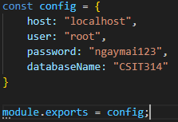

Setup Instruction

1. Go Into Each Folder: backend, customer_interface and restaurant_interface and install dependencies (with npm install).

2. Navigate into folder 'backend' and create a file 'db_config.js' in the same directory as 'server.js'.

3. Inside the file 'db_config.js', create an object config with attribute host, user, password and databasename. Then configure these attributes to match your MySQL server information. Finally, export the object with 'module.exports = config;'.

4. Navigate into folder 'DB_Deployment' and run 'node deployDB.js' to deploy the database. Alternatively, run 'node dropDB.js' to drop the database.